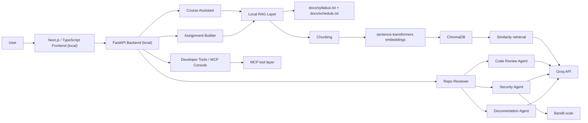
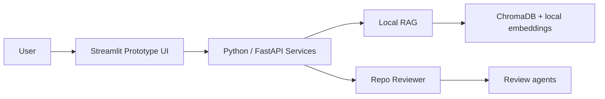
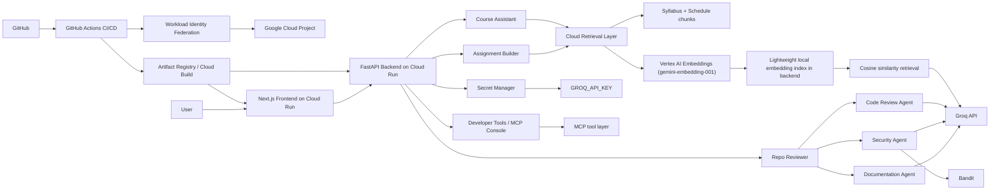
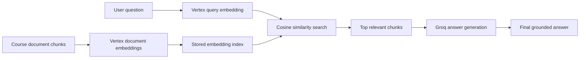
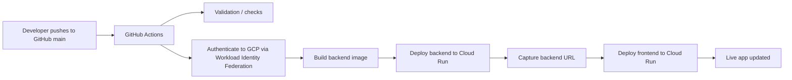
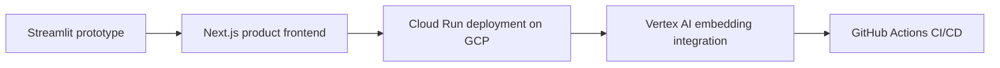
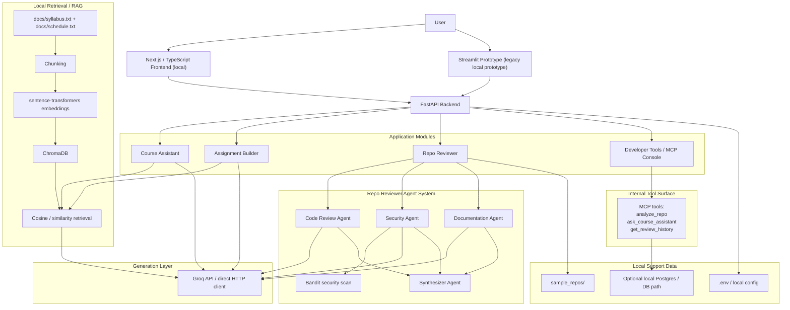
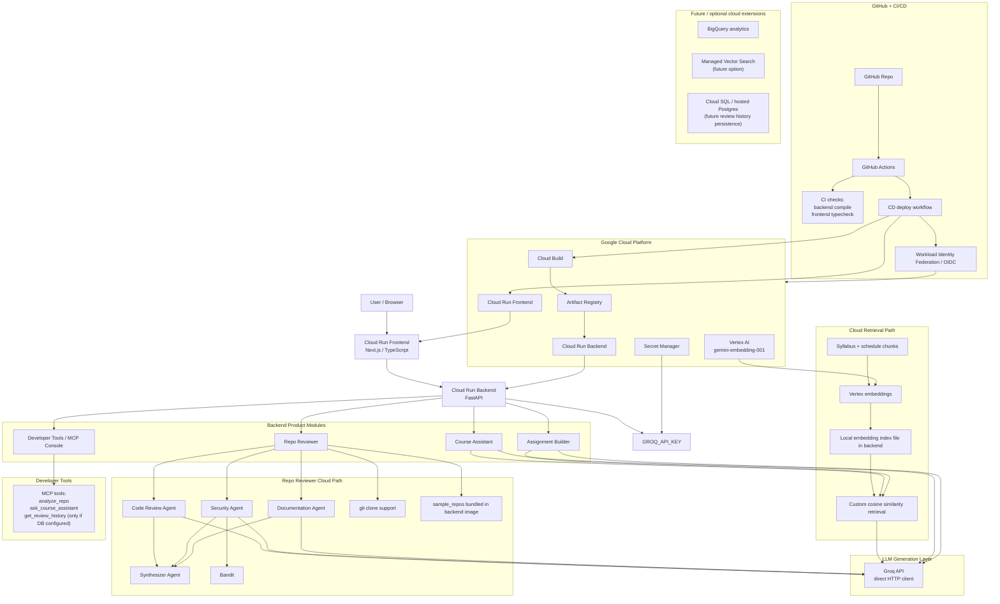

# RepoMentor AI Architecture

This document contains presentation-ready architecture diagrams for RepoMentor AI.

It includes:

1. Local / development architecture
2. Streamlit prototype architecture
3. Cloud / GCP architecture
4. Vertex AI retrieval architecture
5. CI/CD architecture
6. System evolution
7. Two "single comprehensive" architectures:
   - one for the full local system
   - one for the full cloud system

---

## 1. Local / Development Architecture

### Notes
- Frontend is `Next.js / TypeScript`
- Backend is `FastAPI`
- `Course Assistant` and `Assignment Builder` use local RAG
- Local RAG uses:
  - `docs/syllabus.txt`
  - `docs/schedule.txt`
  - chunking
  - `sentence-transformers`
  - `ChromaDB`
- `Repo Reviewer` uses three review agents plus `Bandit`

---

## 2. Streamlit Prototype Architecture

### Notes
- Streamlit was the earlier rapid prototype
- It was useful for validating workflows quickly
- The main product frontend later moved to `Next.js`

---

## 3. Cloud / GCP Architecture

### Notes
- Frontend is deployed to `Cloud Run`
- Backend is deployed to `Cloud Run`
- CI/CD is done through `GitHub Actions`
- Authentication to GCP is done through `Workload Identity Federation`
- Vertex AI is used for embeddings in the cloud path
- Retrieval is still handled by the backend

---

## 4. Vertex AI Retrieval Path

### Notes
- In cloud mode, Vertex AI generates embeddings
- The backend stores and retrieves vectors itself
- This is **not yet** a managed vector search deployment

---

## 5. CI/CD Flow

### Notes
- CI validates code
- CD deploys backend and frontend
- Authentication uses temporary identity, not long-lived service account keys

---

## 6. System Evolution

### Notes
- Streamlit was the proof-of-concept
- Next.js became the polished product UI
- GCP hosting and Vertex AI made the system cloud-native
- CI/CD made deployment repeatable

---

## 7. Comprehensive Local Architecture

This is the "everything in one place" local architecture.

### Local Architecture Summary
- Two local UI paths exist:
  - `Next.js` current product frontend
  - `Streamlit` older prototype path
- One Python backend powers all major product workflows
- Local RAG uses `sentence-transformers + ChromaDB`
- Groq powers generation
- Repo Reviewer is multi-agent and uses `Bandit`
- Developer Tools expose internal MCP-style operations

---

## 8. Comprehensive Cloud / GCP Architecture

This is the "everything in one place" cloud architecture.

### Cloud Architecture Summary
- `GitHub Actions` drives CI/CD
- `Workload Identity Federation` securely connects GitHub Actions to GCP
- Frontend and backend are deployed on `Cloud Run`
- Backend uses:
  - `Secret Manager`
  - `Vertex AI` for embeddings
  - custom retrieval logic for similarity search
  - `Groq` for answer and content generation
- `Repo Reviewer` includes:
  - multi-agent analysis
  - `Bandit`
  - GitHub cloning support
  - bundled sample repos
- BigQuery and managed vector search are natural future improvements, not core to the current working deployment

---

## 9. Presentation Guidance

If you only show two diagrams, show these:

1. **Comprehensive Local Architecture**
2. **Comprehensive Cloud / GCP Architecture**

Those two together cover:
- prototype to product evolution
- local vs cloud behavior
- retrieval path differences
- CI/CD
- deployment
- tool/runtime differences

---

## 10. One-Sentence Architecture Summary

RepoMentor AI evolved from a Streamlit prototype into a Next.js + FastAPI GenAI platform where local development uses ChromaDB and sentence-transformers for retrieval, while the deployed GCP version runs on Cloud Run, uses Vertex AI for embeddings, a custom backend retrieval layer for grounding, Groq for generation, and GitHub Actions CI/CD for repeatable deployment.
